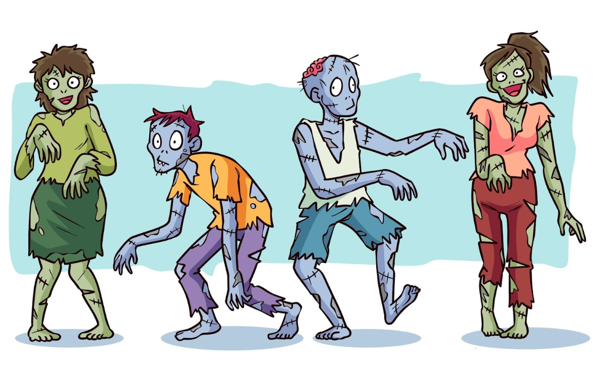

# The Zombie Invasion.

* H = 60
* X = 40
* Y = 20
* P = 3
* Z = 3
* Q = 1
* W = 3
* S = 3
* R = 3

There are H Humans drawn randomly on a X by Y grid (In green). Multiple Humans may occupy the same square.  Each turn each Human will walk P paces in a random direction (N,NE,E,SE,S,SW,W,NW) if a pace places them beyond the grid or bumps into a wall then the pace is not taken and is forfeit.

A number of Zombies Z will be randomly placed in the grid (In red) but will not occupy a square that is already occupied by a Human or Zombie.  Each turn each Zombie will walk Q paces in towards the nearest Human (measured in paces).  If there are multiple Humans the same distance away then the Zombie will hunt one at random unless the Human that the Zombie hunted last turn is amongst the nearest Humans, if so the Zombie will always continue to hunt the same Human.

If a Zombie and a Human exist on exactly the same square then the Human is turned into a Zombie and will change colour and begin to behave as a Zombie.

Turns continue until no more Humans exist.

1) Track the number of turns it takes before the Zombie invasion has wiped out the Humans.

2) Experiment with adjusting the size of the grid (X,Y) and starting number of Humans (H)

3) Add the ability to adjust the invasion speed, pause, play, stop and restart the invasion

4) Introduce W Witchhunters.  
These will be placed randomly on the grid at the start but will not occupy the same square as a Zombie.  A Witchhunter has a Shotgun.  When a Witchhunter is adjacent to a Zombie he will shoot and kill the Zombie (removing the Zombie from the grid).  A Witchhunter can only shoot once per turn and has S number of slugs before he must reload.  It takes R turns for the Witchhunter to reload the Shotgun.
The Witchhunter is also Human and will be turned into a Zombie if he occupies the same square as a Zombie.

5) Experiment with adjusting W, S and R

6) Draw some walls on the grid.  Humans and Zombies alike cannot pass through walls and spaces which would take a Human or Zombie through a wall are forfeit. You cannot shoot through a wall.  This will break line of sight.

7) Think of some other characters you could add to the invasion.

Ideas....
A dog which will wrestle a Zombie to the ground and stop them from moving for several turns before dying.

A marine with an assault rifle.  Capable of shooting longer distances, at multiple enemies per turn and a larger ammo per clip, but takes multiple shots to kill a Zombie.  He moves slower and takes longer to reload.  A marine will move towards the nearest Zombie but will back away from the nearest Zombie if he is reloading.

A sniper.  The sniper has one bullet and a 5 turn reload time.  He has a range of 10 paces and will always move to maintain that optimum range with the nearest Zombie.

Joggers who move faster than a regular Human.  When Joggers turn into Zombies these zombies also move faster.

Suicide bombers. Humans which when caught by a Zombie will explode killing themselves, the zombie and anything else within a radius (including walls)

